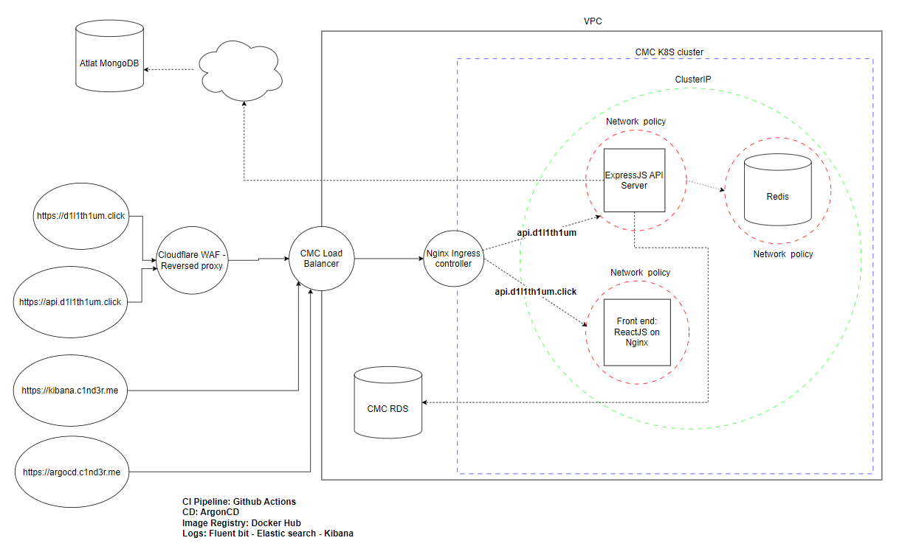

CMC Kubernetes Demo

- CI Pipeline: Github Actions
- CD: ArgonCD
- Image Registry: Docker Hub
- Logs: Fluent Bit - Elastic Search - Kibana
- API server: ExpressJS
- Frontend: ReactJS on Nginx
- Database: MongoDB, Redis, CMC RDS

